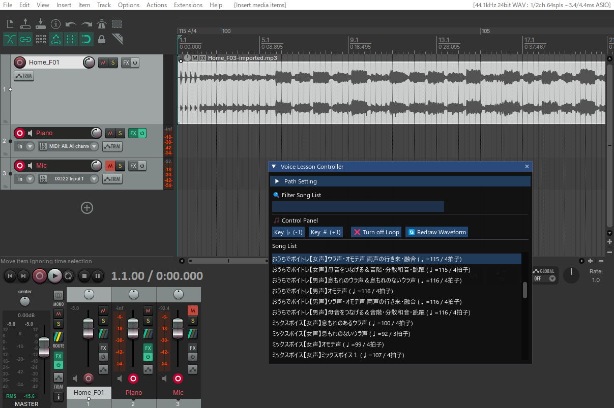

# Voice Lesson Controller for REAPER

ボイストレーナーの視点から開発された、日々のレッスンで練習用音源をスムーズに操作するための REAPER 用 ReaScript（Lua）です。




## 💡 主な機能

- **スマートなプレイリスト生成**
  事前に用意したCSVファイル（ソングリスト）を読み込み、瞬時に練習曲のプレイリストを作成します。
- **自動環境セットアップ**
  選択した曲のテンポ（BPM）や拍子を自動で設定し、トラックへ音源ファイルをロードして即座に再生します。
- **キーワード検索・絞り込み**
  曲名やソングリストに登録したキーワード（例：生徒名、ジャンル、難易度など）で、目的の曲を素早く検索できます。
- **ワンクリック・ループ再生**
  タイム選択した範囲を繰り返し再生可能。苦手なフレーズの集中練習に最適です（解除ボタンで通常再生に戻ります）。
- **リアルタイム・キー変更**
  半音単位でのキー（音程）調整が可能。生徒の声域に合わせた即座のキー変更に対応します。

---

## 🛠 導入方法

1. **スクリプトの保存**
   - `Voice_Lesson_Controller.lua` をダウンロードし、任意の場所（REAPERの `Scripts` フォルダなど）に保存してください。
2. **REAPERでのアクティベート**
   - REAPERを起動し、あらかじめ**最低1つのトラック**を作成しておきます。
   - メニューの `Actions` ＞ `Show action list...` を開きます。
   - `New action` ＞ `Load ReaScript...` から、保存した `Voice_Lesson_Controller.lua` を選択してインポートします。
3. **スクリプトの起動**
   - リストに追加された `Voice_Lesson_Controller.lua` を選択し、`Run` をクリックするとコントロール画面が表示されます。
   - *（※ よく使う場合は、ショートカットキーやツールバーボタンに割り当てておくと便利です）*

---

## 📖 使い方

### 1. 事前準備

#### ① 音源フォルダの作成
練習曲のオーディオファイル（.mp3, .wavなど）を、1つのフォルダにまとめて保存します。

#### ② ソングリスト（CSV）の作成
以下のような仕様でCSVファイルを作成し、任意の場所に保存します。
※文字コードは `UTF-8` での保存を推奨します。

**【CSVフォーマット】**
```text
曲のタイトル,ファイル名（拡張子含む）,キーワード（半角スペース区切り）,BPM,拍子
```

**【作成例】**
| 曲のタイトル | ファイル名 | キーワード | BPM | 拍子 |
| :--- | :--- | :--- | :--- | :--- |
| 春の歌 | harunouta.mp3 | Pop HighVocal 山田 | 120 | 4 |
| 枯葉 | autumn_leaves.wav | Jazz Standard 佐藤 | 90 | 3 |

### 2. 初期設定（初回のみ）
1. 画面内の「**Path Setting**」から、**音源を保存したフォルダ**と**ソングリスト（CSV）**の場所をそれぞれ指定します。
2. 「**Reload**」ボタンをクリックすると、プレイリストが画面に読み込まれます。

### 3. レッスンでの操作
- **曲の再生**: プレイリスト内の曲名をクリックすると、自動で音源がロードされ再生が始まります。
- **ループ再生**: REAPER上で任意の範囲（タイムセレクション）を指定するとループ再生モードになります。ループを終了したいときは、画面内の「**Turn off Loop**」ボタンをクリックします。
- **キー調整**: 音程を変更したいときは、「**Key ♭**」「**Key #**」ボタンをクリックして半音ずつ調整します。
- **再生 / 停止**: 通常通り、REAPER本体のトランスポートバーやスペースキーで操作してください。
